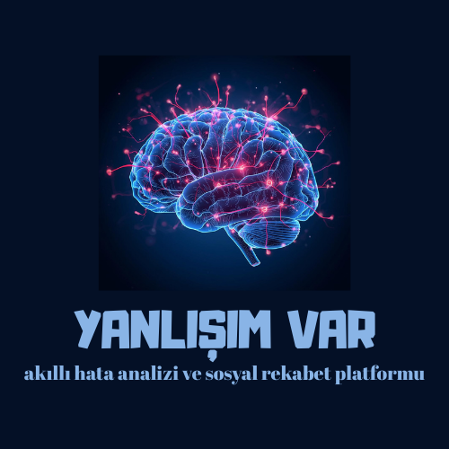

# 🚀 Yanlışım Var - Akıllı Hata Analizi ve Sosyal Rekabet Platformu

Bu proje, kullanıcıların hatalarını analiz etmelerine yardımcı olan ve bu süreci sosyal bir rekabet ortamına dönüştüren, uçtan uca geliştirilmiş bir mobil uygulamadır. 

## ✨ Özellikler
- **Gerçek Zamanlı Veri Yönetimi:** Firebase Firestore ile anlık veri senkronizasyonu.
- **Sosyal Etkileşim:** Arkadaş ekleme sistemi ve Liderlik Tablosu (Leaderboard).
- **Gelişmiş Analiz:** Hata takibi ve sqflite ile yerel veritabanı desteği.
- **Cross-Platform:** Hem Android hem de iOS mimarisine tam uyumluluk.
- **Profesyonel Arayüz:** Özel tasarlanmış Splash Screen (Açılış ekranı) ve modern UI bileşenleri.

## 🛠 Kullanılan Teknolojiler
- **Frontend:** Flutter & Dart
- **Backend:** Firebase (Auth, Firestore)
- **Veritabanı:** sqflite (Local) & Firestore (Cloud)
- **Mimari:** Provider / State Management
- **Versiyon Kontrol:** Git & GitHub

## 📱 Ekran Görüntüleri
| Açılış Ekranı | Ana Ekran | Liderlik Tablosu |
| :---: | :---: | :---: |
|  | (Eklenecek) | (Eklenecek) |

## ⚙️ Kurulum ve Yapılandırma
1. Bu depoyu klonlayın: `git clone https://github.com/kullanici-adi/yanlisim_var.git`
2. Bağımlılıkları yükleyin: `flutter pub get`
3. Firebase yapılandırmasını tamamlayın (`google-services.json` ve `GoogleService-Info.plist`).
4. Uygulamayı çalıştırın: `flutter run`

---
*Bu proje Şubat 2026 itibarıyla geliştirilmiştir.*